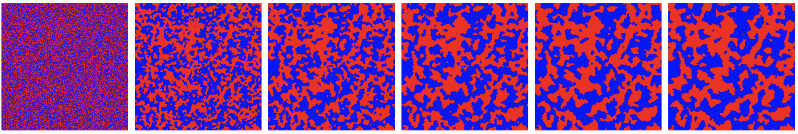

# Research

## Spatial Models, Pattern Formation and Nonlinear Dynamics

### Phase separation in spatial coordination games

> Microbes interact in dense environments. These interactions can span antagonistic to cooperative, and can vary between and across microbial types. Microbes could utilize a proximity-based secretion system to kill individuals of other types without killing microbes of the same type. Such strain-dependent killing led to the emergence of distinct patches which grew in size and structure with spatiotemporal dynamics whose scaling was consistent with _'Model A' coarsening_ (see time lapse images below from a simulation, two groups of microbes are labeled in red and blue). In this paper, we proposed a stochastic spatial game-theoretic framework to model this microbial system, and study the emergence of _coarsening_ using a mean-field approach.

$x$
_yay_

[back](./)
