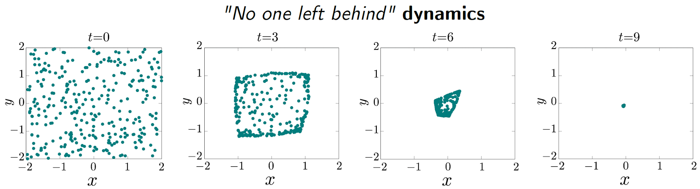

# Research

## Spatial Models, Pattern Formation and Nonlinear Dynamics

### Phase separation in spatial coordination games

Microbes interact in dense environments. These interactions can span antagonistic to cooperative, and can vary between and across microbial types. Microbes could utilize a proximity-based secretion system to kill individuals of other types without killing microbes of the same type. Such strain-dependent killing led to the emergence of distinct patches which grew in size and structure with spatiotemporal dynamics whose scaling was consistent with [_'Model A' Coarsening_](https://sethna.lassp.cornell.edu/Coarsening/What_Is_Coarsening.html) (see time lapse images below from a simulation, two groups of microbes are labeled in red and blue). We proposed a stochastic spatial game-theoretic framework (focusing our attention on [_coordination games_](https://en.wikipedia.org/wiki/Coordination_game)) to model this microbial system, and study the emergence of _coarsening_ using a mean-field approach, manuscript available upon request.

### Spatial dynamics of two competing species with mutually repulsive chemotaxis 
Bacteria can sense a vast range of environmental signals, such as concentrations of nutrients, toxins, or oxygen levels, pH levels, and they can exhibit chemotactic movements either towards or away from a signal. Here, we study a system of PDEs modelling the population dynamics of two competitive species whose spatial movements are governed by both diffusion and mutually repulsive [chemotaxis](http://2016.igem.org/Team:Technion_Israel/Chemotaxis) effects.
* Li, G., & Yao, Y. (2022). Two-species competition model with chemotaxis: well-posedness, stability and dynamics. _Nonlinearity_, 35(3), 1329. [[PDF]](https://iopscience.iop.org/article/10.1088/1361-6544/ac4a8d)

### Consensus in networked multiagent systems
Mathematical models of [_opinion formation_](https://en.wikipedia.org/wiki/Consensus_decision-making) have long been objects of theoretical interest. Models in this context are often posed in an agent based framework where the potential for agents to interact is encoded in a network. The rise of social networks as some of the main forums for the exchange of ideas clearly motivates the need to continue the study of these models. Analysis of the metadata associated with social networks shows that an emergent feature is the formation of polarized communities. Here, we study a class of models that exhibit this phenomenon. We are especially
interested in the emergence of a consensus, i.e., when the opinions of all agents agree.
* Li, G., Motsch, S., & Weber, D. (2020). Bounded confidence dynamics and graph control: enforcing consensus. _Networks & Heterogeneous Media_, 15(3), 489. [[PDF]](https://www.aimsciences.org/article/doi/10.3934/nhm.2020028)

_yay_

[back](./)
