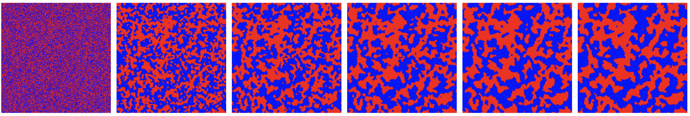
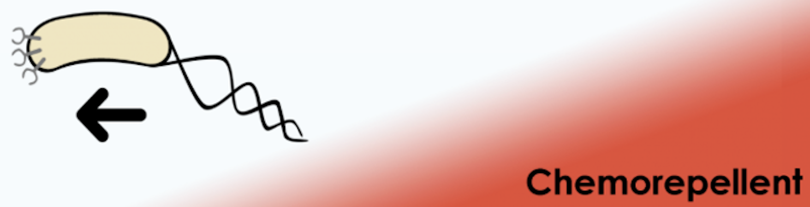
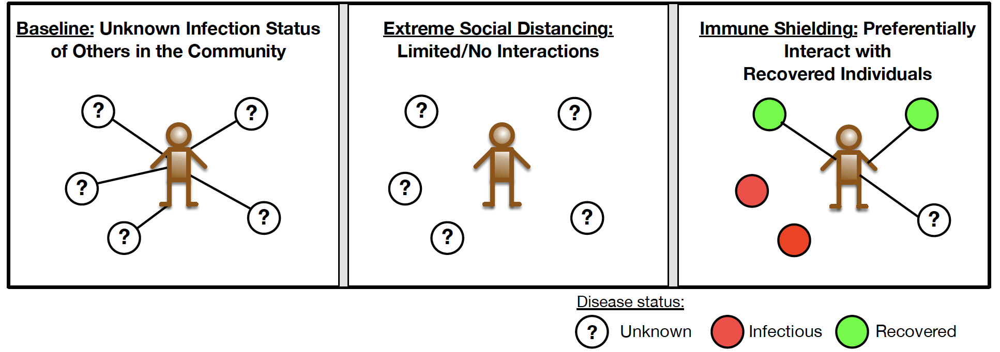
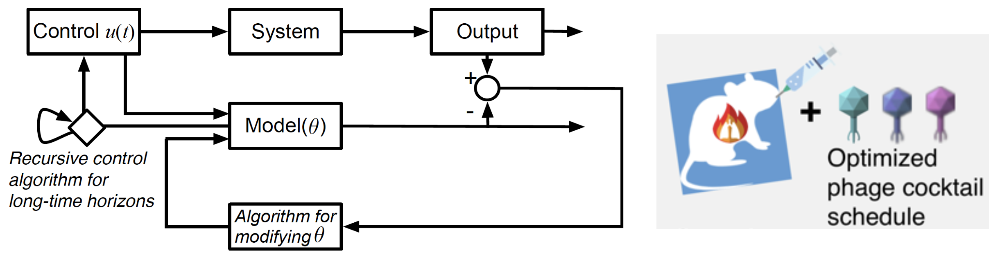
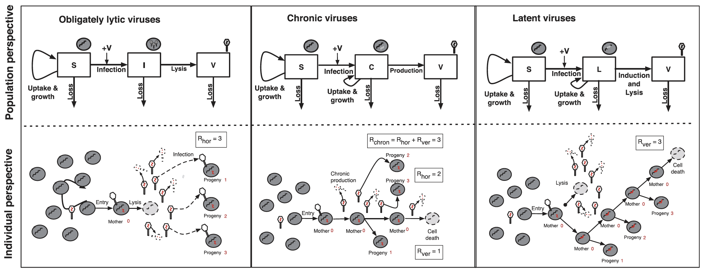

# Research
_My Ph.D. study focused on understanding the structure and dynamics of complex biological systems utilizing the tools of nonlinear dynamics, stochastic processes, and large-scale data analysis._

## Spatial Models, Pattern Formation and Nonlinear Dynamics

### Phase separation in spatial coordination games

Microbes interact in dense environments. These interactions can span antagonistic to cooperative, and can vary between and across microbial types. Microbes could utilize a proximity-based secretion system to kill individuals of other types without killing microbes of the same type. Such strain-dependent killing led to the emergence of distinct patches which grew in size and structure with spatiotemporal dynamics whose scaling was consistent with [_'Model A' Coarsening_](https://sethna.lassp.cornell.edu/Coarsening/What_Is_Coarsening.html) (see time lapse images below from a simulation, two groups of microbes are labeled in red and blue). We proposed a stochastic spatial game-theoretic framework (focusing our attention on [_coordination games_](https://en.wikipedia.org/wiki/Coordination_game)) to model this microbial system, and study the emergence of _coarsening_ using a mean-field approach, manuscript available upon request.

### Spatial dynamics of two competing species with mutually repulsive chemotaxis 
Bacteria can sense a vast range of environmental signals, such as concentrations of nutrients, toxins, or oxygen levels, pH levels, and they can exhibit chemotactic movements either towards or away from a signal. Here, we study a system of PDEs modelling the population dynamics of two competitive species whose spatial movements are governed by both diffusion and mutually repulsive [chemotaxis](http://2016.igem.org/Team:Technion_Israel/Chemotaxis) effects.
* **Li, G.**, & Yao, Y. (2022). Two-species competition model with chemotaxis: well-posedness, stability and dynamics. _Nonlinearity_, 35(3), 1329. [[PDF]](https://iopscience.iop.org/article/10.1088/1361-6544/ac4a8d)

### Consensus in networked multiagent systems
Mathematical models of [_opinion formation_](https://en.wikipedia.org/wiki/Consensus_decision-making) have long been objects of theoretical interest. The rise of social networks as some of the main forums for the exchange of ideas clearly motivates the need to continue the study of these models. The defining feature of the agent-based approach is the study of _how locally defined interaction rules affect globally observed behavior among the agents_. Here, we propose and study a variant of bounded confidence dynamics with the goal of inducing unconditional convergence to a consensus. The defining feature of these dynamics which we name the _"No one left behind dynamics"_ is the introduction of a local control on the agents which preserves the connectivity of the interaction network.
* **Li, G.**, Motsch, S., & Weber, D. (2020). Bounded confidence dynamics and graph control: enforcing consensus. _Networks & Heterogeneous Media_, 15(3), 489. [[PDF]](https://www.aimsciences.org/article/doi/10.3934/nhm.2020028)

## Optimization and control of complex virus-host systems
Optimization and control are powerful tools to design a system that works as effectively as possible. Mathematical optimization and control methods are widely used in engineering and science. The model-based optimization and control frameworks usually deal with modeling complex systems, and the model components are (partially)
known or estimated from data. We combine dynamical models of virus-host systems with optimization- and control-theoretic principles to improve two specific decision-making processes: devise and improve the timing and composition of therapeutic phage cocktails in phage therapy; design non-pharmacological interventions to reduce fatalities arising from COVID-19 while also enabling economic engagement.

### Non-pharmaceutical COVID-19 control
* **Li, G.**, Shivam, S., Hochberg, M. E., Wardi, Y., & Weitz, J. S. (2021). Disease-dependent interaction policies to support health and economic outcomes during the COVID-19 epidemic. _iScience_, p.102710. [[PDF]](https://www.ncbi.nlm.nih.gov/pmc/articles/PMC8189742/)
* Weitz, J. S., Beckett, S. J., Coenen, A. R., Demory, D., Dominguez-Mirazo, M., Dushoff, J., Leung, C.Y., **Li, G.**, Magalie, A., Park. S. W., Rodriguez-Gonzalez, R., Shivam, S., & Zhao, C. Y. (2020). Modeling shield immunity to reduce COVID-19 epidemic spread. _Nature Medicine_, 1-6. [[PDF]](https://www.nature.com/articles/s41591-020-0895-3)

### Phage therapy for control of bacterial infections
* **Li, G.**, Leung, C. Y., Wardi, Y., Debarbieux, L., & Weitz, J. S. (2020). Optimizing the timing and composition of therapeutic phage cocktails: a control-theoretic approach. _Bulletin of Mathematical Biology_, 82(6), 1-29. [[PDF]](https://link.springer.com/article/10.1007/s11538-020-00751-w)

## Evolutionary Dynamics and Adaptive Systems
The prevailing paradigm in ecological studies of viruses and their microbial hosts is that the reproductive success of viruses depends on the proliferation of the _predator_, that is, the virus particle. Yet, viruses are obligate intracellular parasites, and the virus genome—the actual unit of selection—can persist and proliferate from one cell generation to the next without lysis or the production of new virus particles. Here, we propose a theoretical framework to quantify the invasion fitness of viruses using an epidemiological cell-centric metric that focuses on the proliferation of viral genomes inside cells instead of virus particles outside cells.

Phage can infect and lyse their bacterial hosts, releasing new viral progeny. In addition to the lytic pathway, certain bacteriophage (i.e. 'temperate' bacteriophage) can also initiate lysogeny, a latent mode of infection in which the viral genome is integrated into and replicated with the bacterial chromosome. Subsequently, the integrated viral genome, that is the 'prophage', can induce and restart the lytic pathway. Here, we explore the relationship among infection mode, ecological context, and viral fitness, in essence asking: _when should viruses be temperate ?_

* **Li, G.**, Cortez, M. H., Dushoff, J., & Weitz, J. S. (2020). When to be temperate: on the fitness benefits of lysis vs. lysogeny. _Virus Evolution_, 6(2), veaa042.[[PDF]](https://academic.oup.com/ve/article/6/2/veaa042/5842152)
* Weitz, J. S., **Li, G.**, Gulbudak, H., Cortez, M. H., Whitaker, R. J. (2019). Viral invasion fitness across a continuum from lysis to latency. _Virus Evolution_, 5(1), vez006.[[PDF]](https://academic.oup.com/ve/article/5/1/vez006/5476198)

[back to main page](./)
